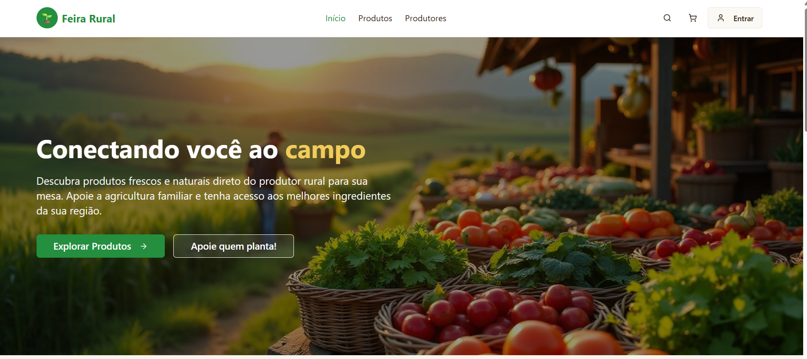

# Feira Rural 

## 🎯 Contribuição aos Objetivos da ONU (ODS 2)

A aplicação **Feira Rural** está alinhada com os Objetivos de Desenvolvimento Sustentável da ONU, em especial o **ODS 2 – Fome Zero e Agricultura Sustentável**, ao:

- 🌾 Apoiar pequenos produtores rurais, ampliando sua renda e visibilidade digital
- 🛒 Promover mercados locais, com cadeias curtas e sustentáveis de comercialização
- 🍅 Facilitar o acesso da população a alimentos frescos, nutritivos e acessíveis
- ✅ Reduzir perdas e desperdícios com vendas diretas sob demanda
- 📚 Incentivar práticas alimentares saudáveis por meio de informações sobre sazonalidade e aproveitamento integral
- 🤝 Fortalecer parcerias entre produtores, consumidores e iniciativas públicas ou comunitárias

Esse alinhamento torna o projeto uma ferramenta concreta de transformação social, com potencial para integrar políticas públicas, programas de financiamento social e estratégias de desenvolvimento sustentável em comunidades rurais e urbanas.  

